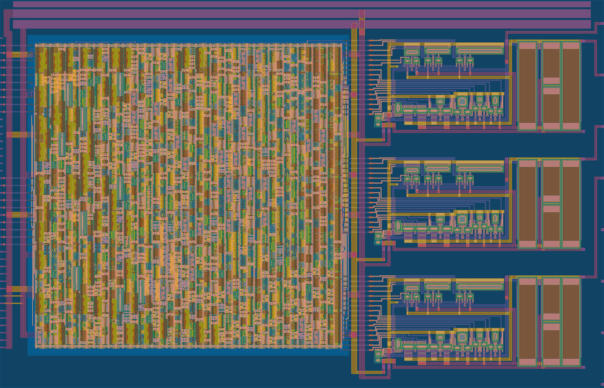

 

# TT08 VGA FUN! (tt08-vga-fun)

An attempt to create rough 8-bit VGA DACs, targeting [Tiny Tapeout 08 (TT08)](https://tinytapeout.com/runs/), and building on my prior experiment (and first analog ASIC project) in TT06: [tt06-grab-bag](https://github.com/algofoogle/tt06-grab-bag).

- [Read the documentation for this project](docs/info.md)

NOTE: This repo was created from: https://github.com/TinyTapeout/tt08-analog-template

## What is Tiny Tapeout?

Tiny Tapeout is an educational project that aims to make it easier and cheaper than ever to get your digital designs manufactured on a real chip.

To learn more and get started, visit https://tinytapeout.com.

## Analog projects

For TT analog specifications and instructions, see the [analog specs page](https://tinytapeout.com/specs/analog/).

## Enable GitHub actions to build the results page

- [Enabling GitHub Pages](https://tinytapeout.com/faq/#my-github-action-is-failing-on-the-pages-part)

## Resources

- [FAQ](https://tinytapeout.com/faq/)
- [Digital design lessons](https://tinytapeout.com/digital_design/)
- [Learn how semiconductors work](https://tinytapeout.com/siliwiz/)
- [Join the community](https://tinytapeout.com/discord)

